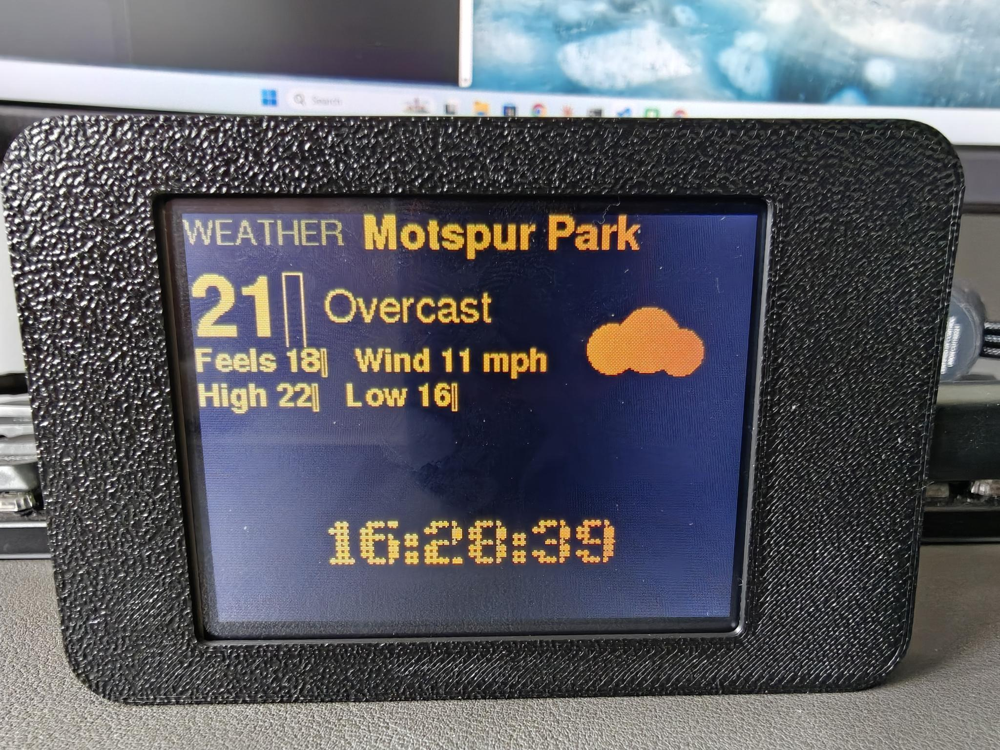

# Departure Buddy

**A live departure board for your desk.** Real UK train departures, London bus
arrivals and Thames river boat sailings — on a small screen, updating by itself.
No coding. No soldering. About £15 of hardware and ten minutes — all you need
is **one of two supported boards** and a USB cable.

---

## What it shows

Pick any combination and the board cycles through them.

| | |
|---|---|
| **Trains** | Anywhere in the UK, from National Rail |
| **Buses** | Any London stop live from TfL, free and keyless. Anywhere else in the UK via [TransportAPI](docs/transportapi-key.md), which needs a free key |
| **River boats** | Uber Boat by Thames Clippers and the Woolwich Ferry |
| **Weather** | Right where your stop is — no extra setup |
| **A big clock** | The time, filling the screen |

Each screen shows the next three departures with live countdowns, delays and
cancellations in red, and a big clock that keeps itself right.

Overnight it doesn't just go dark — it turns down to a dimmed clock you can
still read across a room.

**The two buttons on the front do something useful.** The lower one puts the
clock up full-screen, and again puts it back; the upper one skips straight to
the next panel instead of waiting. Overnight, either wakes the board to full
brightness for a few seconds.

---

## 1. Buy a board

Two boards are supported. Either works fully — same screens, same setup page,
same live data. Pick on size and price.

| | **LilyGo T-Display-S3** | **ESP32 Cheap Yellow Display** |
|---|---|---|
| Screen | 1.9″, 320×170 | 2.8″, 320×240 |
| Rows shown | 3 departures | **4 departures** |
| Buttons | **Two**, on the front | None usable |
| Touchscreen | No | Yes, resistive (see below) |
| Chip | ESP32-S3, 16 MB flash, PSRAM | ESP32, 4 MB flash, no PSRAM |
| Flashing | Plug in and go | **Hold its BOOT button** |
| Price | ~£12–20 | ~£12–18 |

### → [Buy the T-Display-S3 on Amazon UK](https://www.amazon.co.uk/LILYGO-T-Display-S3-ESP32-S3-Display-Development/dp/B0BRTT727Z?th=1&linkCode=ll2&tag=oktaneza-21&linkId=5466662ac0076e3e099592eae3f54ffc&ref_=as_li_ss_tl)
### → [Buy the Cheap Yellow Display on Amazon UK](https://www.amazon.co.uk/dp/B0F24X83FC?tag=oktaneza-21)

(They're affiliate links and they're the only kickback I get for maintaining
this project)

Full detail on what differs between them, and why, is in
[docs/boards.md](docs/boards.md).

The setup page asks which board you have and sends the right firmware. It also
checks: if the board on the cable is not the one you picked, it refuses to write
anything rather than leaving you with a board that will not boot.

---

### LilyGo T-Display-S3

The smaller, tidier one. Also from [LilyGo directly](https://lilygo.cc/en-us/products/t-display-s3)
or [AliExpress (official store)](https://www.aliexpress.com/item/1005004496543314.html)
— cheaper, but slower to arrive.

Get the standard **1.9″ 170×320** version. The Touch edition works too. Choose
**pin headers pre-soldered** unless you want to solder. Nothing else to buy —
screen, WiFi and USB-C are all on board.

Its two front buttons work: one holds the big clock on screen, the other steps
to the next panel.

> ⚠️ Don't buy the look-alikes: **AMOLED** (1.91″), **Pro** (2.33″), **Long**
> (3.4″), or the older **T-Display** (ESP32, 1.14″). None of them work with this.

---

### ESP32 Cheap Yellow Display (ESP32-2432S028R)

Bigger screen for about the same money, and the extra height buys a fourth row
of departures. Sold under many names; look for the model number
**ESP32-2432S028R** and the distinctive yellow circuit board.

*Four departures at once, with cancellations in red — a row more than the
smaller board fits.*

*(Case not included — that one is 3D printed.)*

Three things to know before you buy:

- **You must hold the BOOT button to flash it.** Most of these boards have no
  working auto-program circuit, so they cannot put themselves into programming
  mode. The setup page tells you when to hold it. After that, changing settings
  needs no button at all.
- **The touchscreen may not be connected.** The panel is wired for resistive
  touch, but on the unit tested here the touch layer reads as an open circuit —
  a known fault on some clones, where the ribbon is not seated. Everything else
  works; you just get no buttons and no touch, so the board simply cycles
  through your screens.
- **Two display controllers ship under the same name.** The firmware handles
  both, so this does not affect what you buy — it is only why the code carries a
  build flag for it.

> ⚠️ This is the **2.8″ resistive** model, `ESP32-2432S028R`. The larger 3.5″
> and 4.3″ boards in the same family are not supported.

---

## 2. Open the setup page

### → **[tinyurl.com/bdddxxr4](https://tinyurl.com/bdddxxr4)**

Use **Chrome or Edge on a computer** — they can talk to the board over USB.

Firefox and Safari can't, so they hand you a settings file instead. Drop that
onto the **[Windows installer](https://github.com/OktaneZA/ESP32Departures/releases/latest)** and it does the same job.

---

## 3. Set it up

Everything happens on that one page.

Find your stop by **postcode, place name, or station name** — no codes to look
up. It shows you what's actually due right now, so you know you picked the
right one.

Choose your colours and how long each screen stays up, and watch the preview
change as you go.

Then plug the board into USB, click **Connect & configure**, and pick it from
the list. That's it — the board restarts showing live times.

### If you want trains

Train data needs a free key from the Rail Data Marketplace — register, subscribe
to "Live Departure Board", and copy the key.

### → **[Step-by-step, with screenshots](docs/api-key.md)**

The setup page checks the key for you before you plug the board in, so a typo is
caught straight away. **Buses and river boats need no key** — skip this entirely
if you're not showing trains.

---

## Changing it later

Go back to the same page any time and reconfigure. Settings live on the board
itself, so they survive being unplugged — and survive firmware updates too.

---

## More

| | |
|---|---|
| [Getting your train data key](docs/api-key.md) | Free National Rail key, step by step with screenshots |
| [Download the Windows installer](https://github.com/OktaneZA/ESP32Departures/releases/latest) | For Firefox and Safari, or if you prefer a desktop app |
| [Setup walkthrough](installer/README.md) | Using the installer, and troubleshooting |
| [Technical detail](DETAILS.md) | Building the firmware, the data feeds, project layout |
| [The setup page itself](web/README.md) | Running or hosting your own copy |
| [Security](SECURITY.md) | Verifying your firmware, and what is and isn't protected |
| [Requirements](REQUIREMENTS.md) | The full specification |

---

> **Credits.** The train board is derived from Chris Crocker-White's
> [chrisys/train-departure-display](https://github.com/chrisys/train-departure-display)
> (original concept, layout, and dot-matrix fonts) via this repo's
> [Raspberry Pi rewrite](https://github.com/OktaneZA/PiDepartures).
> See [REQUIREMENTS.md](REQUIREMENTS.md) for full lineage.
>
> Bus and river data provided by **Transport for London**. Train data from
> **National Rail Darwin** via the
> [Rail Data Marketplace](https://raildata.org.uk). Station positions contain
> public sector information licensed under the
> [Open Government Licence v3.0](https://www.nationalarchives.gov.uk/doc/open-government-licence/version/3/).
