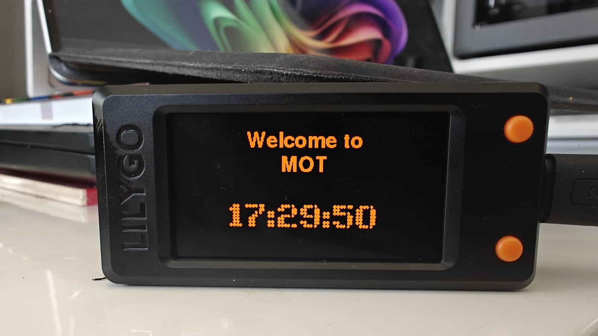

# Esp32Departures — UK Train & Bus Departure Display (LilyGo T-Display-S3)

A C++/JSON rewrite of the [Raspberry Pi departure board](https://github.com/OktaneZA/PiDepartures) for the
**LilyGo T-Display-S3** (ESP32-S3, 1.9″ 170×320 ST7789 LCD). No Pi, no Docker, no
server — the ESP32 fetches live UK train and now bus departures over WiFi and drives the built-in
colour LCD directly. The aim was to make this even simpler and cheaper than previous iterations. £10 + some 
effort and you can have this running.

> **Credits.** Derived from Chris Crocker-White's
> [chrisys/train-departure-display](https://github.com/chrisys/train-departure-display)
> (original concept, layout, and dot-matrix fonts) via this repo's native
> Raspberry Pi rewrite. See [REQUIREMENTS.md](REQUIREMENTS.md) for full lineage.

The Pi app talks to National Rail's legacy SOAP/XML OpenLDBWS feed. This firmware
uses the **same National Rail (Darwin) data**, but via the modern REST/JSON
**Live Departure Board (LDBWS)** product on the free
**[Rail Data Marketplace](https://raildata.org.uk)** — parsed on-device with
ArduinoJson. (The old SOAP token no longer works; the marketplace REST API
replaced it.)

## What it looks like


*Live departures for local station — bold first row, per-train status
("On time" / "Delayed"), scrolling long destinations, and a dot-matrix clock,
running on a T-Display-S3 in a standard case.*



*The welcome screen shown while the first departures are fetched.*

## What it does

- Live departures for a local train station (optionally filtered to a destination or platform)
- Live London bus departures for local bus stops
- Top three departures shown large: time + destination, with status
  (delay/cancellation) and platform when relevant; long names scroll
- Big NTP clock in a dot-matrix font, with automatic BST
- Exponential back-off on API failure, stale data kept on screen with a
  "No signal" indicator, and a connectivity-warning screen after 3 failures
- Optional screen-blank hours; runtime-adjustable brightness

## Install — the easy way (Windows)

Most people should use the **self-contained Windows installer** — no toolchain,
no editing files, no compiling:

1. Get a LilyGo T-Display-S3 and a free LDBWS API key. The
   **[installer README](installer/README.md)** has the hardware buying links and a
   step-by-step raildata.org.uk walkthrough for the key.
2. Plug the board into USB and run **`Esp32DeparturesInstaller.exe`**.
3. Answer the prompts (WiFi, API key, station, filters, …). Done — the board
   reboots showing departures.

Settings are stored **on the device**, so to change them later just run the
installer again and pick **Configure only** (no re-flash). Full details:
**[installer/README.md](installer/README.md)**.

## Build from source (developers only)

You only need this to modify the firmware. Configuration is **not** compiled in —
the board is provisioned at runtime (by the installer, or the serial protocol in
`src/config.cpp`), so there is **no `secrets.h` to edit**.

1. Install **[PlatformIO](https://platformio.org/install)** (VS Code extension or
   the `pio` CLI).
2. Build / flash / monitor:
   ```bash
   pio run                 # compile
   pio run -t upload       # flash over USB-C
   pio device monitor      # serial logs (115200)
   ```
3. Provision the freshly-flashed board with the installer, or by sending the
   serial protocol directly (`PING` / `CFG key=value` / `COMMIT`).

Compile-time tunables live in `include/app_config.h` (layout, back-off, time
window, `HIDE_ONTIME_STATUS`, `RAW_JSON_DEBUG`). After a firmware change, refresh
the installer's bundled binary: copy `.pio/build/lilygo-t-display-s3/firmware.bin`
into `installer/firmware/` and run `installer/build_exe.py`.

## How it maps to the Pi app

| Pi app (Python)                         | This firmware (C++)                          |
|-----------------------------------------|----------------------------------------------|
| OpenLDBWS SOAP + `xmltodict`            | LDBWS REST/JSON + ArduinoJson (`rail_api.cpp`) |
| `luma.oled` SSD1322 256×64 mono         | LovyanGFX ST7789 320×170 colour (`display.cpp`) |
| render thread + fetch thread + `Lock`   | `loop()` (core 1) + fetch task (core 0) + mutex |
| exponential back-off (ARCH-01)          | `backoffMs()` in `main.cpp`                  |
| stale data + "No signal" (ARCH-02)      | `errCount` overlay in `renderBoard()`        |
| connectivity warning (ARCH-03)          | `renderConnectivityWarning()`                |
| blank hours (DISP-05)                   | `isBlankHour()`                              |
| config file + install.sh                | on-device NVS + USB installer (`config.cpp`) |
| PIL dot-matrix TTF fonts                | dot-matrix clock via `docs/ttf_to_lgfx.py` (rows use FreeSans) |

## Project layout

```
firmware/esp32-tdisplay-s3/
├── platformio.ini            PlatformIO env, board, libs
├── REQUIREMENTS.md           canonical requirements + attribution
├── include/
│   ├── app_config.h          compile-time tunables
│   ├── config.h              on-device (NVS) runtime config
│   ├── dotmatrix_fonts.h     generated dot-matrix font (clock)
│   ├── model.h / rail_api.h / display.h
├── src/
│   ├── main.cpp              WiFi, NTP, fetch task, render loop
│   ├── config.cpp            NVS config + USB-serial provisioning
│   ├── rail_api.cpp          National Rail LDBWS REST/JSON client
│   └── display.cpp           LovyanGFX panel config + rendering
├── docs/                     board mockups + font-conversion script
└── installer/                self-contained Windows installer (.exe)
```

## Notes

- **Verify field names on first run:** the LDBWS JSON serialises the SOAP schema;
  `destination` and `subsequentCallingPoints` vary in nesting. `rail_api.cpp`
  parses both known shapes; set `RAW_JSON_DEBUG 1` in `app_config.h` to print a
  raw response and confirm, then set it back.
- **API route:** if your subscription's "API" tab shows a base path other than
  `1010-live-departure-board-dep1_2/...`, update `kBase` in `rail_api.cpp`.
- **TLS:** `rail_api.cpp` calls `client.setInsecure()` — encrypted but the server
  certificate isn't verified. For full protection paste `api1.raildata.org.uk`'s
  root CA and switch to `client.setCACert(...)` (a hook is already in place).
- **Calling points** arrive in the same response but aren't shown in the current
  top-three layout (`FETCH_CALLING_POINTS 0`).
