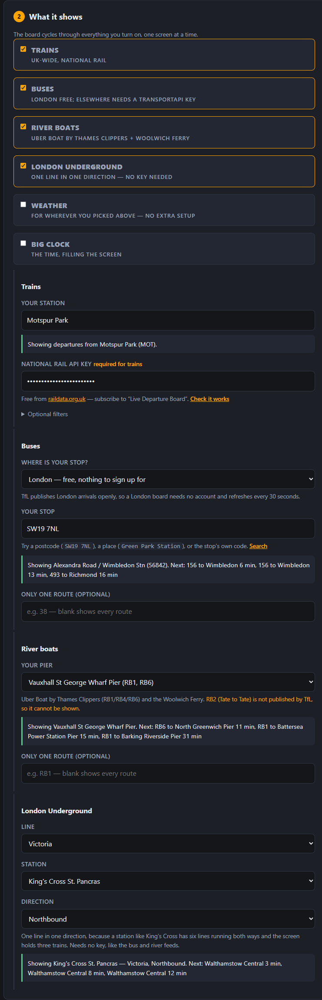
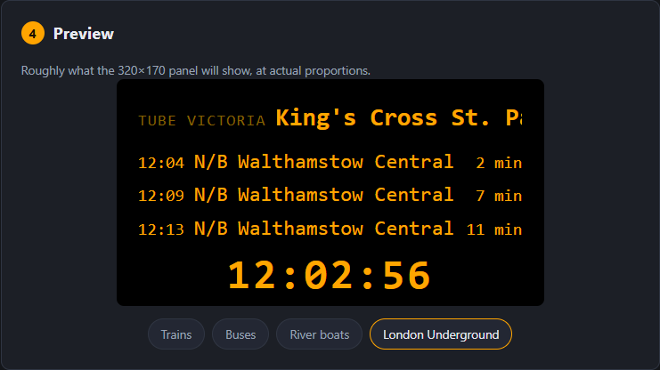

# Departure Buddy

**A live departure board for your desk.** Real UK train departures, London bus
arrivals and Thames river boat sailings — on a small screen, updating by itself.

No coding. No soldering. About £15 of hardware and ten minutes — all you need is
a [LilyGo T-Display-S3](https://www.amazon.co.uk/LILYGO-T-Display-S3-ESP32-S3-Display-Development/dp/B0BRTT727Z?th=1&linkCode=ll2&tag=oktaneza-21&linkId=5466662ac0076e3e099592eae3f54ffc&ref_=as_li_ss_tl) and a USB-C cable.

---

## What it shows

Pick any combination and the board cycles through them.

| | |
|---|---|
| **Trains** | Anywhere in the UK, from National Rail |
| **London buses** | Any stop, live from TfL |
| **River boats** | Uber Boat by Thames Clippers and the Woolwich Ferry |

Each screen shows the next three departures with live countdowns, delays and
cancellations in red, and a big clock that keeps itself right.

---

## 1. Buy the board

You need one thing: a **LilyGo T-Display-S3** — around **£12–20**.

### → [Buy on Amazon UK](https://www.amazon.co.uk/LILYGO-T-Display-S3-ESP32-S3-Display-Development/dp/B0BRTT727Z?th=1&linkCode=ll2&tag=oktaneza-21&linkId=5466662ac0076e3e099592eae3f54ffc&ref_=as_li_ss_tl) (Its an affiliate link and its the only kickback I get for maintaining this project)

Also from [LilyGo directly](https://lilygo.cc/en-us/products/t-display-s3) or
[AliExpress (official store)](https://www.aliexpress.com/item/1005004496543314.html)
— cheaper, but slower to arrive.

Get the standard **1.9″ 170×320** version. The Touch edition works too. Choose
**pin headers pre-soldered** unless you want to solder. Nothing else to buy —
screen, WiFi and USB-C are all on board.

> ⚠️ Don't buy the look-alikes: **AMOLED** (1.91″), **Pro** (2.33″), **Long**
> (3.4″), or the older **T-Display** (ESP32, 1.14″). None of them work with this.

---

## 2. Open the setup page

### → **[tinyurl.com/bdddxxr4](https://tinyurl.com/bdddxxr4)**

Use **Chrome or Edge on a computer** — they can talk to the board over USB.
(Firefox and Safari can't, so they give you a settings file for the Windows
installer instead.)

---

## 3. Set it up

Everything happens on that one page.

Find your stop by **postcode, place name, or station name** — no codes to look
up. It shows you what's actually due right now, so you know you picked the
right one.

Choose your colours and how long each screen stays up, and watch the preview
change as you go.

Then plug the board into USB, click **Connect & configure**, and pick it from
the list. That's it — the board restarts showing live times.

### If you want trains

Train data needs a free key from the Rail Data Marketplace — register, subscribe
to "Live Departure Board", and copy the key.

### → **[Step-by-step, with screenshots](docs/api-key.md)**

The setup page checks the key for you before you plug the board in, so a typo is
caught straight away. **Buses and river boats need no key** — skip this entirely
if you're not showing trains.

---

## Changing it later

Go back to the same page any time and reconfigure. Settings live on the board
itself, so they survive being unplugged — and survive firmware updates too.

---

## More

| | |
|---|---|
| [Getting your train data key](docs/api-key.md) | Free National Rail key, step by step with screenshots |
| [Setup walkthrough](installer/README.md) | The Windows installer and troubleshooting |
| [Technical detail](DETAILS.md) | Building the firmware, the data feeds, project layout |
| [The setup page itself](web/README.md) | Running or hosting your own copy |
| [Requirements](REQUIREMENTS.md) | The full specification |

---

> **Credits.** The train board is derived from Chris Crocker-White's
> [chrisys/train-departure-display](https://github.com/chrisys/train-departure-display)
> (original concept, layout, and dot-matrix fonts) via this repo's
> [Raspberry Pi rewrite](https://github.com/OktaneZA/PiDepartures).
> See [REQUIREMENTS.md](REQUIREMENTS.md) for full lineage.
>
> Bus and river data provided by **Transport for London**. Train data from
> **National Rail Darwin** via the
> [Rail Data Marketplace](https://raildata.org.uk). Station positions contain
> public sector information licensed under the
> [Open Government Licence v3.0](https://www.nationalarchives.gov.uk/doc/open-government-licence/version/3/).
