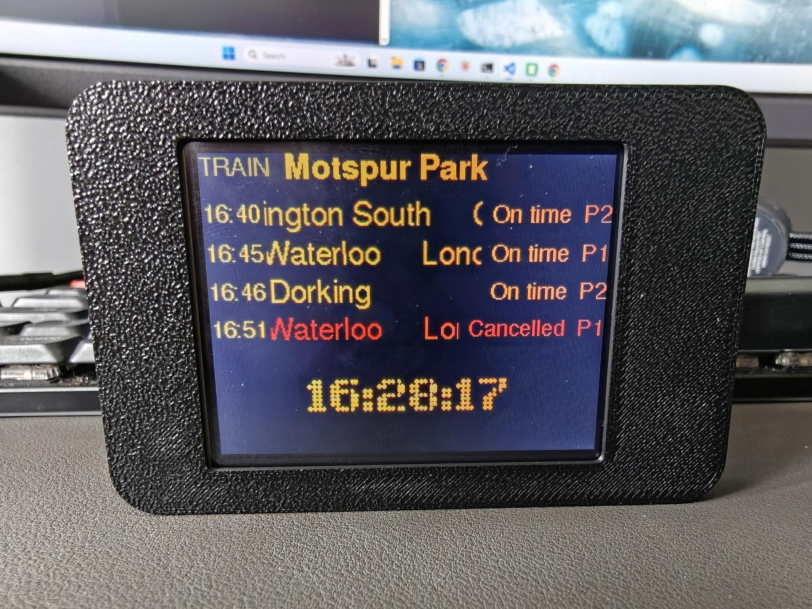
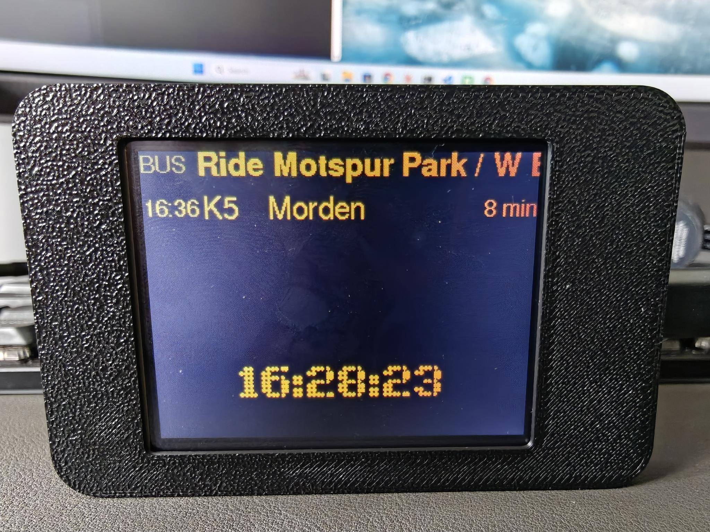

<div align="center">

# Departure Buddy

### A real departure board for your desk — trains, buses and river boats, live.<br>About £15 of hardware. Ten minutes. No code.

[](https://github.com/OktaneZA/ESP32Departures/releases/latest)
[](LICENSE)


<b><a href="https://tinyurl.com/bdddxxr4">▶&nbsp; Start here — open the setup page</a></b>
&nbsp;&nbsp;·&nbsp;&nbsp;
<a href="#1-pick-a-board">🛒&nbsp; Buy a board</a>
&nbsp;&nbsp;·&nbsp;&nbsp;
<a href="docs/boards.md">📟&nbsp; Choosing a board</a>
&nbsp;&nbsp;·&nbsp;&nbsp;
<a href="DETAILS.md">🔧&nbsp; How it works</a>

</div>

---

## Never miss another train because you were making coffee

You know the sign at your station — the one that tells you the 08:42 is four
minutes late and running to platform 3. This puts that sign on your desk, at
your front door, or in your kitchen, showing **your** stop.

Shop-bought desktop departure boards
[start around £165](https://ukdepartureboards.co.uk/store/). This one is a £15
board and a USB cable, and it does more: trains, London buses, Thames river
boats, weather and a clock, cycling through whichever you care about.

Everything happens in a web page. **You don't write a line of code, edit a
config file, solder anything, or install a toolchain.** Plug the board into your
computer, pick your stop by postcode, click a button. It restarts showing live
times and it never needs your computer again.

---

## What it shows

<table>
<tr>
<td width="33%"></td>
<td width="33%"></td>
<td width="33%"></td>
</tr>
<tr>
<td align="center"><b>Trains</b><br><sub>Any UK station, live from National Rail</sub></td>
<td align="center"><b>Buses</b><br><sub>Any London stop — free, no key needed</sub></td>
<td align="center"><b>River boats</b><br><sub>Thames Clippers &amp; the Woolwich Ferry</sub></td>
</tr>
</table>

Plus **weather** for wherever your stop is, and a **full-screen clock** in a
proper dot-matrix font. Enable any combination — the board cycles through them.

| | |
|---|---|
| 🚆 **Trains** | Anywhere in the UK, from National Rail. Filter to a destination or platform |
| 🚌 **Buses** | Every London stop, live from TfL — **free and keyless**. Rest of the UK via [TransportAPI](docs/transportapi-key.md) |
| ⛴️ **River boats** | Uber Boat by Thames Clippers (RB1/RB4/RB6) and the Woolwich Ferry |
| 🌦️ **Weather** | Right where your stop is. No extra setup, no second account |
| 🕐 **Clock** | NTP-accurate, automatic BST, fills the screen on demand |

---

## Why it stays plugged in

- **It's genuinely live.** Real predictions, not a timetable. Countdowns tick
  between polls; delays and cancellations go red.
- **It handles the internet falling over.** Exponential back-off, last-known
  times stay on screen with a *No signal* marker, and a clear warning after
  three failures. It doesn't just freeze on stale data pretending everything's
  fine.
- **It's polite at night.** Instead of going black, it dims to a clock you can
  still read across a dark room. Press a button and it wakes to full brightness
  for a few seconds.
- **The buttons do something.** On the T-Display-S3, one holds the big clock up
  and the other skips to the next panel instead of waiting for it.
- **Make it yours.** Classic amber, white, phosphor green, high contrast — or
  any colour you pick — plus how long each screen holds. All from the web page,
  no recompiling.
- **Settings live on the board.** They survive unplugging, and they survive
  firmware updates.
- **You can check what it's running.** The board reports the MD5 of its own
  firmware, and the setup page verifies it against the published release. See
  [SECURITY.md](SECURITY.md).

---

## 1. Pick a board

Both work fully — same screens, same setup page, same live data. Choose on size
and price.

<table>
<tr><th></th><th>LilyGo T-Display-S3</th><th>ESP32 Cheap Yellow Display</th></tr>
<tr><td><b>Screen</b></td><td>1.9″, 320×170</td><td>2.8″, 320×240</td></tr>
<tr><td><b>Departures shown</b></td><td>3</td><td><b>4</b></td></tr>
<tr><td><b>Buttons</b></td><td><b>Two, on the front</b></td><td>None usable</td></tr>
<tr><td><b>Chip</b></td><td>ESP32-S3, 16 MB flash, PSRAM</td><td>ESP32, 4 MB flash</td></tr>
<tr><td><b>Flashing</b></td><td>Plug in and go</td><td>Hold the BOOT button</td></tr>
<tr><td><b>Price</b></td><td>~£12–20</td><td>~£12–18</td></tr>
<tr><td><b>Best for</b></td><td>Smaller, tidier, buttons that work</td><td>A bigger screen and a fourth row</td></tr>
</table>

<div align="center">

<b><a href="https://www.amazon.co.uk/LILYGO-T-Display-S3-ESP32-S3-Display-Development/dp/B0BRTT727Z?th=1&linkCode=ll2&tag=oktaneza-21&linkId=5466662ac0076e3e099592eae3f54ffc&ref_=as_li_ss_tl">🛒 Buy the T-Display-S3 (Amazon UK)</a></b>
&nbsp;&nbsp;·&nbsp;&nbsp;
<b><a href="https://www.amazon.co.uk/dp/B0F24X83FC?tag=oktaneza-21">🛒 Buy the Cheap Yellow Display (Amazon UK)</a></b>

<sub>Affiliate links — the only kickback I get for maintaining this project.</sub>

</div>

The setup page asks which board you have and sends the matching firmware. If the
board on the cable isn't the one you picked, **it refuses to write anything**
rather than leaving you with a brick.

<details>
<summary><b>Buying the T-Display-S3 — read this first</b></summary>

<br>

Get the standard **1.9″ 170×320** version. The Touch edition works too. Choose
**pin headers pre-soldered** unless you actually want to solder. Nothing else to
buy — screen, WiFi and USB-C are all on board.

Also available [direct from LilyGo](https://lilygo.cc/en-us/products/t-display-s3)
or [AliExpress (official store)](https://www.aliexpress.com/item/1005004496543314.html)
— cheaper, slower to arrive.

> ⚠️ **Don't buy the look-alikes.** The **AMOLED** (1.91″), **Pro** (2.33″),
> **Long** (3.4″) and the older **T-Display** (ESP32, 1.14″) do not work with
> this.

</details>

<details>
<summary><b>Buying the Cheap Yellow Display — read this first</b></summary>

<br>

Sold under many names. Look for the model number **ESP32-2432S028R** and the
distinctive yellow circuit board.




*Four departures at once. Case not included — that one is 3D printed.*

Three things to know:

- **You must hold the BOOT button to flash it.** Most of these boards have no
  working auto-program circuit, so they can't put themselves into programming
  mode. The setup page tells you exactly when to hold it. After that, changing
  settings needs no button at all.
- **The touchscreen may not be connected.** The panel is wired for resistive
  touch, but on the unit tested here the touch layer reads as an open circuit —
  a known fault on some clones where the ribbon isn't seated. Everything else
  works; you just get no buttons, so the board simply cycles through your
  screens.
- **Two display controllers ship under the same name.** The firmware handles
  both, so it doesn't affect what you buy.

> ⚠️ This is the **2.8″ resistive** model, `ESP32-2432S028R`. The 3.5″ and 4.3″
> boards in the same family are not supported.

</details>

Full comparison and the reasoning behind it: [docs/boards.md](docs/boards.md).

---

## 2. Open the setup page

<div align="center">

### **[→ tinyurl.com/bdddxxr4](https://tinyurl.com/bdddxxr4)**


</div>

Use **Chrome, Edge or Opera on a computer** — they can talk to the board over
USB. Firefox and Safari have no Web Serial support at all, so switching browser
is the quickest fix; failing that, the command-line tools in this repository do
the same job from a terminal.

---

## 3. Set it up

Everything happens on that one page.


Find your stop by **postcode, place name or station name** — no codes to look
up. It shows you what's actually due right now, so you know you picked the right
one.


Pick your colours and how long each screen holds, and watch the preview change as
you go. Then plug the board in and use the two steps at the bottom of the page:

1. **Flash the firmware** — once on a new board, and again for updates. It
   carries straight on into step 2, so normally this one button does everything.
2. **Send my settings** — for a board that already has the firmware. This is the
   one to use whenever you change what it shows.

Pick your board from the list your browser offers, and it restarts showing live
times.

**Changing it later?** Same page, any time. Nothing is baked into the firmware.

---

## Do I need an API key?

| | Key needed? |
|---|---|
| London buses | **No.** TfL's feed is open |
| Thames river boats | **No.** Same feed |
| Weather | **No** |
| Clock | **No** |
| **UK trains** | **Yes** — free, from the Rail Data Marketplace |
| Buses outside London | Yes — free, from [TransportAPI](docs/transportapi-key.md) |

Train data needs a free key: register, subscribe to *Live Departure Board*, copy
the key. The setup page validates it before you plug the board in, so a typo is
caught immediately.

### → **[Step-by-step, with screenshots](docs/api-key.md)**

If you're not showing trains, skip this entirely.

---

## Documentation

| | |
|---|---|
| [Getting your train data key](docs/api-key.md) | Free National Rail key, step by step with screenshots |
| [Getting your bus data key](docs/transportapi-key.md) | Only for stops outside London |
| [Choosing a board](docs/boards.md) | What differs between the two, and why |
| [Technical detail](DETAILS.md) | Building the firmware, the data feeds, project layout |
| [The setup page itself](web/README.md) | Running or hosting your own copy |
| [Command-line installer](installer/README.md) | A desktop alternative — **T-Display-S3 only** |
| [Security](SECURITY.md) | Verifying your firmware, and what is and isn't protected |
| [Requirements](REQUIREMENTS.md) | The full specification |

---

## Built with

C++ on [PlatformIO](https://platformio.org),
[LovyanGFX](https://github.com/lovyan03/LovyanGFX) for the display,
[ArduinoJson](https://arduinojson.org) for the feeds, and
[esptool-js](https://github.com/espressif/esptool-js) so a browser can flash a
board over USB. Configuration is provisioned at runtime over serial — there is
no `secrets.h` to edit.

```bash
pio run                          # compile both boards
pio run -e cyd                   # just the Cheap Yellow Display
pio run -e lilygo-t-display-s3 -t upload
pio device monitor               # serial logs (115200)
```

Contributions and issue reports are welcome.

---

<div align="center">

**MIT licensed.** If you build one, I'd love to see it — open an issue with a
photo.

</div>

> **Credits.** The train board is derived from Chris Crocker-White's
> [chrisys/train-departure-display](https://github.com/chrisys/train-departure-display)
> (original concept, layout and dot-matrix fonts) via this repo's
> [Raspberry Pi rewrite](https://github.com/OktaneZA/PiDepartures). Full lineage
> in [REQUIREMENTS.md](REQUIREMENTS.md).
>
> Bus and river data provided by **Transport for London**. Train data from
> **National Rail Darwin** via the [Rail Data Marketplace](https://raildata.org.uk).
> Station positions contain public sector information licensed under the
> [Open Government Licence v3.0](https://www.nationalarchives.gov.uk/doc/open-government-licence/version/3/).
