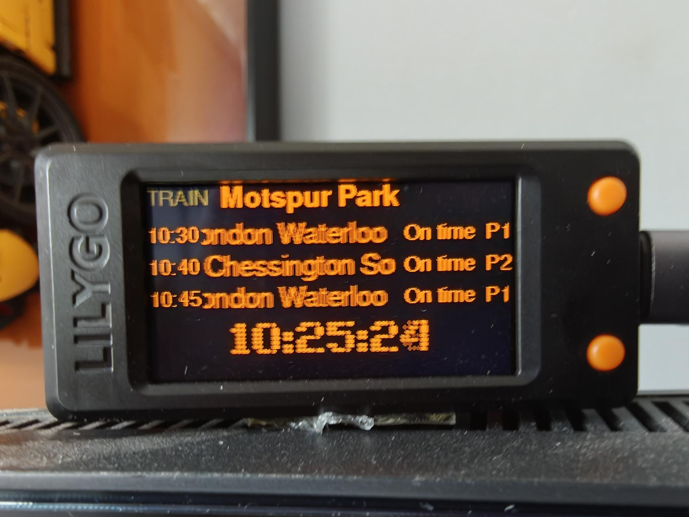
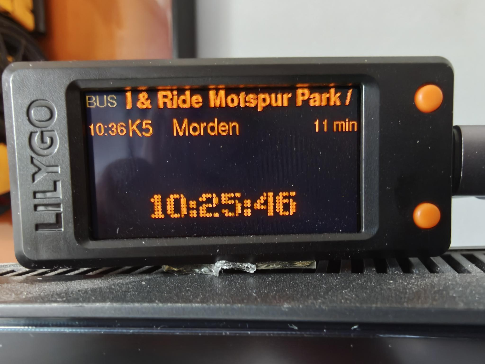
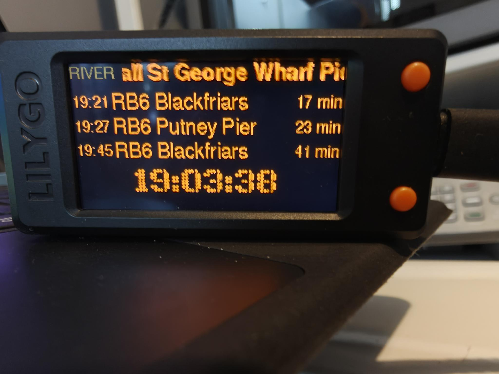
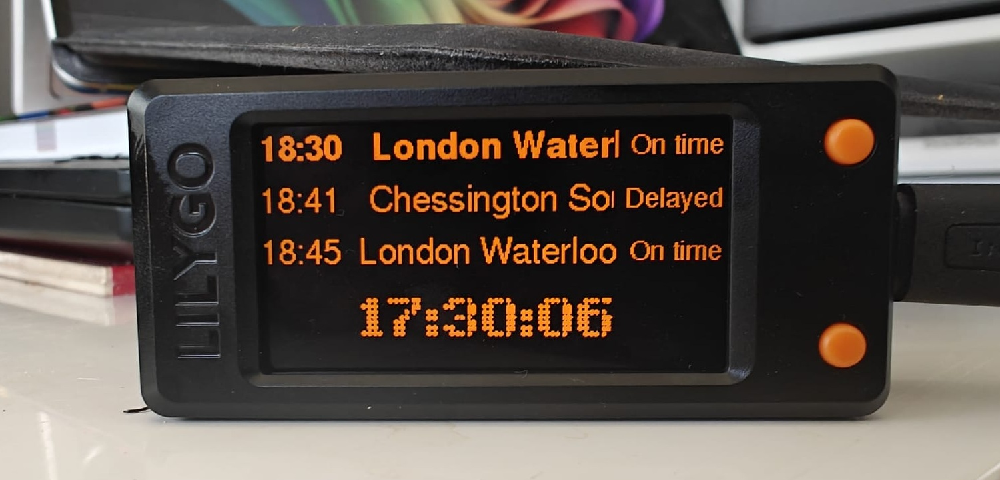

# Esp32Departures — UK Train, London Bus & River Boat Board (LilyGo T-Display-S3)

A C++/JSON rewrite of the [Raspberry Pi departure board](https://github.com/OktaneZA/PiDepartures) for the
**LilyGo T-Display-S3** (ESP32-S3, 1.9″ 170×320 ST7789 LCD). No Pi, no Docker, no
server — the ESP32 fetches live UK train departures over WiFi and drives the
built-in colour LCD directly. It can also show **live London bus arrivals** for
one stop and **live river boat sailings** (Uber Boat by Thames Clippers and the
Woolwich Ferry) from one pier. Every service is optional — enable any
combination and the board cycles through them.

The aim was to make this even simpler and cheaper than previous iterations —
£10 + some effort and you can have this running.

> **Credits.** Derived from Chris Crocker-White's
> [chrisys/train-departure-display](https://github.com/chrisys/train-departure-display)
> (original concept, layout, and dot-matrix fonts) via this repo's native
> Raspberry Pi rewrite. See [REQUIREMENTS.md](REQUIREMENTS.md) for full lineage.

The Pi app talks to National Rail's legacy SOAP/XML OpenLDBWS feed. This firmware
uses the **same National Rail (Darwin) data**, but via the modern REST/JSON
**Live Departure Board (LDBWS)** product on the free
**[Rail Data Marketplace](https://raildata.org.uk)** — parsed on-device with
ArduinoJson. (The old SOAP token no longer works; the marketplace REST API
replaced it.)

## What it looks like

All three screens share one layout: a header row naming the mode and the
station, stop or pier, three rows, then the clock. The board cycles through
whichever you have enabled.



*Trains — departures for Motspur Park, with per-train status ("On time" /
"Exp HH:MM" / "Cancelled" in red) and platform. Long destinations scroll, caught
here mid-marquee on "London Waterloo".*



*London buses — expected time, route number, destination, and a countdown that
ticks down between polls. A hail & ride stop with a single K5 due.*



*River boats — Uber Boat by Thames Clippers sailings from Vauxhall St George
Wharf Pier, with the RB6 route where a bus route number would sit.*

Two mockups rendered by `docs/render_mockup.py` — which mirrors
`src/display.cpp` pixel-for-pixel — are also in `docs/` if you want the layout
without a camera in the way.



*The board in a standard case. Photographed before the shared header row was
added, so its on-screen layout differs slightly from the three above.*

## What it does

- Live departures for a station (optionally filtered to a destination or platform)
- **Trains, buses, boats — any combination** — you choose at setup. The board
  cycles through whatever is enabled (trains 30s, buses 15s, boats 15s); with a
  single service it stays on that screen
- **London bus arrivals** for one stop from TfL's open Countdown feed — expected
  time, route number, destination, and a "Due" / "N min" countdown that ticks
  between polls
- **River boat sailings** for one Thames pier from TfL's open Unified API —
  Uber Boat by Thames Clippers (RB1/RB4/RB6) and the Woolwich Ferry, drawn on
  the same layout as the bus screen with the route ("RB1") where the bus number
  goes. Real live predictions, not a timetable
- Top three departures: time + destination, with status (delay/cancellation)
  and platform when relevant; long names scroll
- Big NTP clock in a dot-matrix font, with automatic BST
- Exponential back-off on API failure, stale data kept on screen with a
  "No signal" indicator, and a connectivity-warning screen after 3 failures
- Optional screen-blank hours; runtime-adjustable brightness

## Install — the easy way (Windows)

Most people should use the **self-contained Windows installer** — no toolchain,
no editing files, no compiling:

1. Get a LilyGo T-Display-S3 and a free LDBWS API key. The
   **[installer README](installer/README.md)** has the hardware buying links and a
   step-by-step raildata.org.uk walkthrough for the key.
2. Plug the board into USB and run **`Esp32DeparturesInstaller.exe`**.
3. Answer the prompts. It asks first which services you want — **trains,
   London buses, river boats**, any combination — then only what those need. A
   boats-only board is never asked for an API key or a station, and the pier is
   picked by name from a list rather than by ID. Done — the board reboots
   showing live times.

Settings are stored **on the device**, so run the installer again any time. If a
configured board is detected it offers three choices:

| | What it does |
|---|---|
| **[C] Change settings** | Keeps the firmware, walks the prompts |
| **[U] Update firmware only** | Asks nothing — new firmware, every setting kept |
| **[F] Update firmware AND change settings** | Both |

Every prompt is pre-filled from what the board is already using, and the WiFi
password and API key accept a blank answer meaning *keep the existing one*, so
neither ever has to be retyped. Full details:
**[installer/README.md](installer/README.md)**.

## Build from source (developers only)

You only need this to modify the firmware. Configuration is **not** compiled in —
the board is provisioned at runtime (by the installer, or the serial protocol in
`src/config.cpp`), so there is **no `secrets.h` to edit**.

1. Install **[PlatformIO](https://platformio.org/install)** (VS Code extension or
   the `pio` CLI).
2. Build / flash / monitor:
   ```bash
   pio run                 # compile
   pio run -t upload       # flash over USB-C
   pio device monitor      # serial logs (115200)
   ```
3. Provision the freshly-flashed board with the installer, or by sending the
   serial protocol directly (`PING` / `CFG key=value` / `COMMIT`). `GET` reports
   the current config (secrets never echoed — the WiFi password only as
   `passlen`) and `SCAN` lists the networks the board's own radio can see, which
   is usually the fastest way to diagnose a board that will not connect.

Compile-time tunables live in `include/app_config.h`: layout, back-off, time
window, `HIDE_ONTIME_STATUS`, `RAW_JSON_DEBUG`, the bus settings
(`TRAIN_SCREEN_SECONDS`, `BUS_SCREEN_SECONDS`, `BUS_REFRESH_SECONDS`,
`MAX_BUS_ARRIVALS`, `RAW_BUS_DEBUG`) and the river settings
(`RIVER_SCREEN_SECONDS`, `RIVER_REFRESH_SECONDS`, `MAX_RIVER_ARRIVALS`,
`RIVER_MAX_ETA_MINUTES`, `RAW_RIVER_DEBUG`). After a firmware change, refresh
the installer's bundled binary: copy `.pio/build/lilygo-t-display-s3/firmware.bin`
into `installer/firmware/` and run `installer/build_exe.py`.

## How it maps to the Pi app

| Pi app (Python)                         | This firmware (C++)                          |
|-----------------------------------------|----------------------------------------------|
| OpenLDBWS SOAP + `xmltodict`            | LDBWS REST/JSON + ArduinoJson (`rail_api.cpp`) |
| `luma.oled` SSD1322 256×64 mono         | LovyanGFX ST7789 320×170 colour (`display.cpp`) |
| render thread + fetch thread + `Lock`   | `loop()` (core 1) + fetch task (core 0) + mutex |
| exponential back-off (ARCH-01)          | `backoffMs()` in `main.cpp`                  |
| stale data + "No signal" (ARCH-02)      | `errCount` overlay in `renderBoard()`        |
| connectivity warning (ARCH-03)          | `renderConnectivityWarning()`                |
| blank hours (DISP-05)                   | `isBlankHour()`                              |
| config file + install.sh                | on-device NVS + USB installer (`config.cpp`) |
| PIL dot-matrix TTF fonts                | dot-matrix clock via `docs/ttf_to_lgfx.py` (rows use FreeSans) |
| (no bus support)                        | optional TfL bus screen (`bus_api.cpp`), cycled from `loop()` |
| (no river support)                      | optional TfL river screen (`river_api.cpp`), same rotation |

## Project layout

```
ESP32Departures/
├── platformio.ini            PlatformIO env, board, libs
├── REQUIREMENTS.md           canonical requirements + attribution
├── include/
│   ├── app_config.h          compile-time tunables
│   ├── config.h              on-device (NVS) runtime config
│   ├── dotmatrix_fonts.h     generated dot-matrix font (clock)
│   ├── model.h / rail_api.h / bus_api.h / river_api.h / display.h
├── src/
│   ├── main.cpp              WiFi, NTP, fetch task, render loop
│   ├── config.cpp            NVS config + USB-serial provisioning
│   ├── rail_api.cpp          National Rail LDBWS REST/JSON client
│   ├── bus_api.cpp           TfL live bus arrivals (Countdown/URA) client
│   ├── river_api.cpp         TfL live river sailings (Unified API) client
│   └── display.cpp           LovyanGFX panel config + rendering
├── docs/                     mockup renderer + font-conversion script
└── installer/                self-contained Windows installer (.exe)
```

## Notes

- **Verify field names on first run:** the LDBWS JSON serialises the SOAP schema;
  `destination` and `subsequentCallingPoints` vary in nesting. `rail_api.cpp`
  parses both known shapes; set `RAW_JSON_DEBUG 1` in `app_config.h` to print a
  raw response and confirm, then set it back.
- **API route:** if your subscription's "API" tab shows a base path other than
  `1010-live-departure-board-dep1_2/...`, update `kBase` in `rail_api.cpp`.
- **TLS:** `rail_api.cpp` calls `client.setInsecure()` — encrypted but the server
  certificate isn't verified. For full protection paste `api1.raildata.org.uk`'s
  root CA and switch to `client.setCACert(...)` (a hook is already in place).
- **Calling points** arrive in the same response but aren't shown in the current
  top-three layout (`FETCH_CALLING_POINTS 0`).
- **London buses** come from TfL's
  [Live Bus & River Bus Arrivals API](https://content.tfl.gov.uk/tfl-live-bus-river-bus-arrivals-api-documentation.pdf)
  (the Countdown "URA" feed), which needs no key. Its responses are one JSON
  array per line, and fields come back in the spec's own sequence order rather
  than the order requested — `bus_api.cpp` documents the exact shape it relies
  on, and `RAW_BUS_DEBUG` in `app_config.h` prints raw lines to check it.
  Screen timings are `TRAIN_SCREEN_SECONDS` / `BUS_SCREEN_SECONDS`.
  Data provided by Transport for London.
- **River boats** come from TfL's Unified API `river-bus` mode
  (`https://api.tfl.gov.uk/StopPoint/{pier}/Arrivals`), which also needs no key.
  Despite its name, the Countdown/URA feed the bus screen uses returns *only*
  buses — piers are not in it — which is why this is a separate client. Note
  the pier ID must be the **port** (`930GCAW`), not one of the berths
  (`9300CAW1`): a berth sees only half its pier's sailings. `timeToStation` is
  already relative, so the countdown is right even before NTP has synced.
  RB2 (Tate to Tate) is not published on this feed. Screen timing is
  `RIVER_SCREEN_SECONDS`. Data provided by Transport for London.
