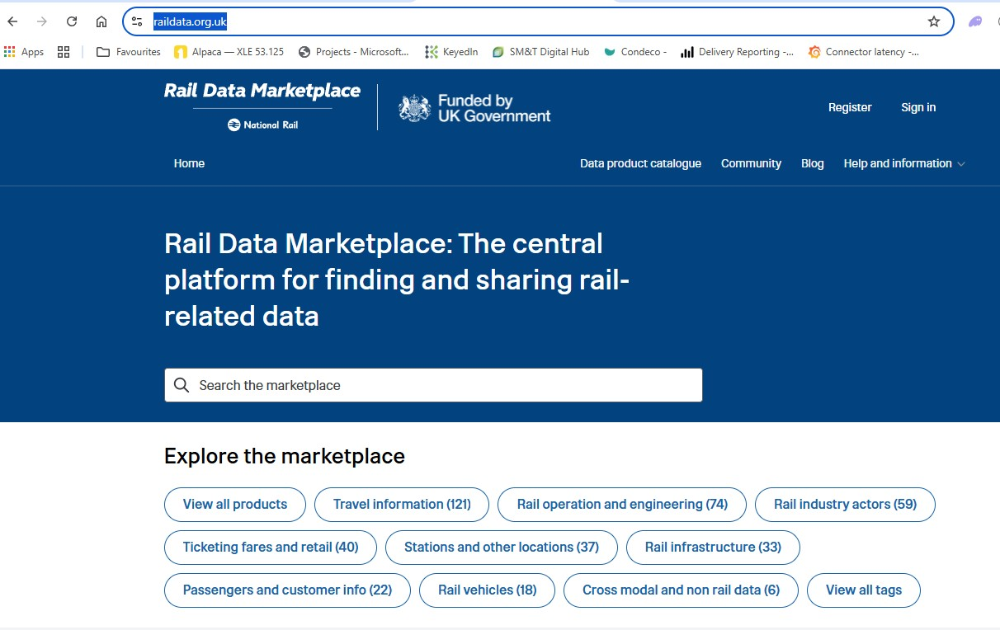
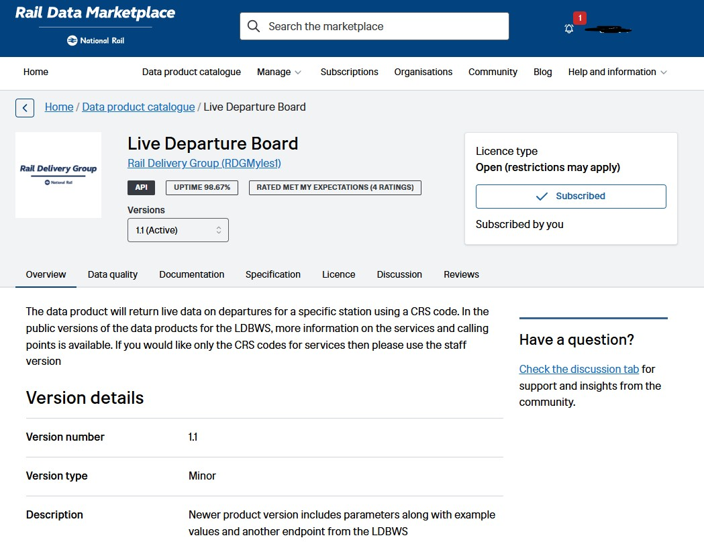
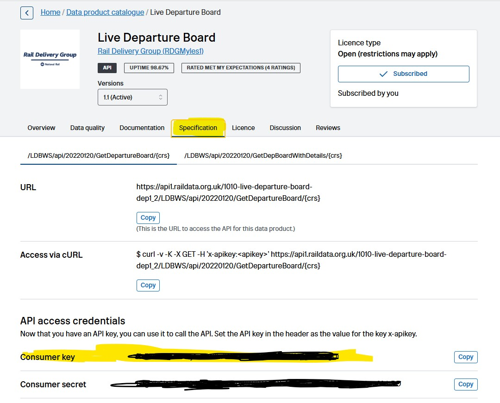

# Getting your train data key

Departure Buddy needs a free key to show **train** departures. It comes from the
Rail Data Marketplace, the official National Rail data platform, and takes about
five minutes.

**Buses and river boats need no key at all.** If you are not showing trains, you
can skip this entire page.

---

## 1. Create an account

Go to **[raildata.org.uk](https://raildata.org.uk/)** and click **Register**.

Register a **personal account** and verify your email address. It is free, and
there is nothing to pay at any point.

---

## 2. Subscribe to "Live Departure Board"

Sign in, then search the marketplace for **Live Departure Board** — or go
straight to the
**[data product catalogue](https://raildata.org.uk/dashboard/dataProduct/catalogue)**
and find it there.

Click **Subscribe**. It is the free open tier and approval is normally instant.

When it has worked, the box on the right shows **Subscribed**, as above.

> ⚠️ **Do not pick the "Demo Version".** It is capped at 100 calls per 30 days.
> The board refreshes every minute, so a demo key is exhausted within a couple
> of hours and the screen goes blank.

---

## 3. Copy your Consumer key

On the same product page, open the **Specification** tab.

Scroll down to **API access credentials**. Your **Consumer key** is the first
row — click **Copy**.

Two things people trip over here:

- It is the **Consumer key** you want, not the **Consumer secret** underneath it.
  The board never uses the secret.
- The key is on the **Specification** tab, not Overview or Documentation.

---

## 4. Paste it into the setup page

Go back to **[the setup page](https://tinyurl.com/bdddxxr4)**, tick **Trains**,
and paste the key into **National Rail API key**.

Then click **Check it works**. It asks the real API whether your key and station
are accepted, and tells you straight away — so a mistyped key is caught before
you plug the board in at all.

---

## If it does not work

| What you see | What it means |
|---|---|
| **"That key was rejected"** | The key is wrong or incomplete — copy it again with the **Copy** button rather than selecting it by hand. Check you took the *key*, not the *secret*. |
| **"The key works, but XXX was rejected"** | The key is fine; the station code is not. Pick your station from the search list rather than typing a code. |
| **Board shows departures, then stops** | Almost always a **Demo Version** subscription running out of calls. Subscribe to the free open tier instead. |
| **"Couldn't reach the API just now"** | A network problem at your end or theirs — it does not mean the key is wrong. Try again shortly. |

Still stuck? The board itself will tell you: it shows a red **"Unknown station"**
screen for a bad station code, and its serial log reports the exact HTTP status
the API returned. See [troubleshooting](../installer/README.md#troubleshooting).
