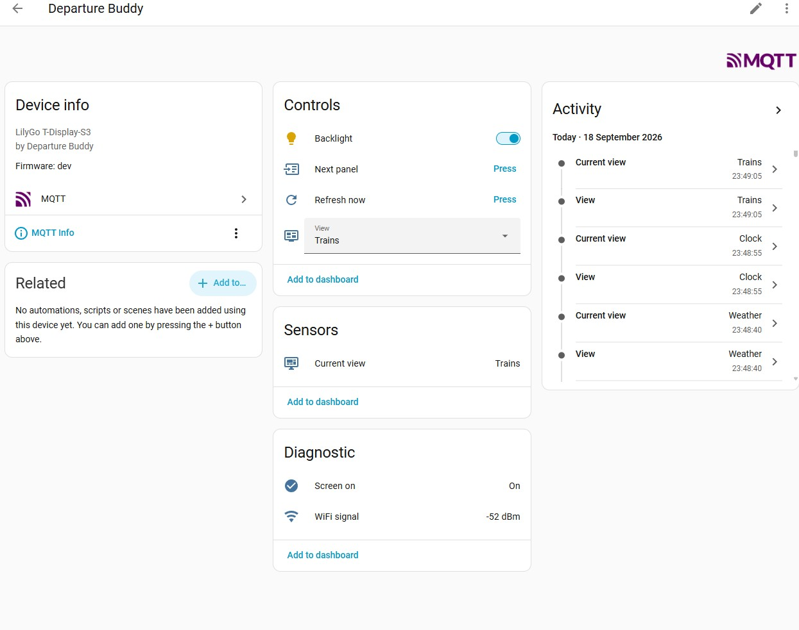

# Home Assistant over MQTT

Departure Buddy can appear in Home Assistant as a device you can automate: turn
the screen on and off, set its brightness, change panel, force a refresh, and
read back what it is showing.



The feature is **optional and off by default**. A board with no broker
configured never opens a socket and behaves exactly as it always has.

The thing it makes possible, which the board cannot do alone:

> **Keep the screen off until a motion sensor says somebody is there.**

A board on its own only knows the clock, so the best it can do is "dark between
22:00 and 06:00". Home Assistant knows whether anyone is in the room.

---

## What you need

| | |
|---|---|
| **An MQTT broker** on your network | Mosquitto is the usual choice. Two ways to run it, below |
| **Home Assistant's MQTT integration**, pointed at that broker | Settings → Devices & Services → Add Integration → MQTT |
| **The broker's IP address** | Not a `.local` name — see [Troubleshooting](#troubleshooting) |
| **Firmware with Home Assistant support** | Older firmware answers `ERR key mqtthost` and refuses the settings. Re-flash from the setup page and it will take them |

You do **not** need credentials if your broker allows anonymous connections,
which is common on a home network. You do not need to expose anything to the
internet, and the board never talks to a cloud service.

---

## Option A — the Home Assistant add-on (easiest)

If you run Home Assistant OS or Supervised, the broker is a few clicks away.

1. **Settings → Add-ons → Add-on Store → Mosquitto broker → Install**, then
   **Start**. Turn on *Start on boot* and *Watchdog*.
2. Home Assistant will offer to set up the **MQTT integration** on its own —
   accept it. If it does not, add it manually and point it at `core-mosquitto`.
3. Create a user for the board: **Settings → People → Users → Add**, e.g.
   `departurebuddy`. The Mosquitto add-on authenticates against Home Assistant
   users by default.
4. Find the broker's IP: **Settings → System → Network**, or whatever address
   you use to reach Home Assistant itself.

Then configure the board with that address, port `1883`, and the username and
password you just created.

> Home Assistant users are not the same as the add-on's own `logins:` option.
> Either works; creating a normal HA user is the path with fewer surprises.

---

## Option B — a containerised broker

If Home Assistant runs in Docker, or your broker lives somewhere else entirely,
run Mosquitto as its own container.

**`docker-compose.yml`**

```yaml
services:
  mosquitto:
    image: eclipse-mosquitto:2
    container_name: mosquitto
    restart: unless-stopped
    ports:
      - "1883:1883"
    volumes:
      - ./mosquitto/config:/mosquitto/config
      - ./mosquitto/data:/mosquitto/data
      - ./mosquitto/log:/mosquitto/log
```

**`mosquitto/config/mosquitto.conf`** — anonymous, simplest, fine on a trusted
home network:

```conf
listener 1883
allow_anonymous true

persistence true
persistence_location /mosquitto/data/
```

Persistence matters more than it looks: Home Assistant discovery messages are
**retained**, so a broker that forgets them loses your entities on restart until
the board reconnects.

**With a password instead** — recommended if anything else shares the network:

```conf
listener 1883
allow_anonymous false
password_file /mosquitto/config/passwd

persistence true
persistence_location /mosquitto/data/
```

Create the password file, then restart:

```bash
docker compose run --rm mosquitto \
  mosquitto_passwd -c -b /mosquitto/config/passwd departurebuddy 'your-password'
docker compose up -d
```

Then point Home Assistant at it: **Settings → Devices & Services → Add
Integration → MQTT**, using the host machine's IP, port `1883`, and the same
credentials.

> **Both the board and Home Assistant must reach the same broker.** If Home
> Assistant is containerised on a different host or a different Docker network,
> check it can actually see port 1883 — this is the single most common reason
> the board connects happily and no device ever appears.

---

## Configuring the board

Any of the three ways of setting the board up will do it.

**Setup page** — open the configurator, and under **Board basics** expand
**Home Assistant (optional)**. Tick *Publish to an MQTT broker*, fill in the
address, and set a username and password only if your broker needs them.

**Command-line installer** — it asks during *Part 1, board basics*, right after
the timezone. It also tries the broker from your PC and says whether it
answered.

**Over serial**, if you prefer:

```
CFG mqtthost=192.168.1.73
CFG mqttport=1883
CFG mqttuser=departurebuddy
CFG mqttpass=your-password
CFG mqtten=1
COMMIT
```

### The settings

| Key | Default | Meaning |
|---|---|---|
| `mqtthost` | — | Broker IP. **Empty means the whole feature is off** |
| `mqttport` | `1883` | Broker port |
| `mqttuser` | — | Empty connects anonymously |
| `mqttpass` | — | **Secret.** Reported back only as `mqttpasslen`, never as a value |
| `mqttprefix` | `departurebuddy` | Root of every topic the board publishes |
| `mqtten` | on | `0` switches it off **but keeps the settings** |

`mqtten=0` exists so that turning the integration off for a while does not mean
clearing — and later retyping — a password the board will never read back to
you.

---

## What appears in Home Assistant

One device, seven entities:

| Entity | Type | What it does |
|---|---|---|
| **Backlight** | light | On/off and brightness 0–255. The one that matters |
| **Next panel** | button | Step to the next screen |
| **Refresh now** | button | Fetch every feed immediately |
| **View** | select | Jump straight to a screen |
| **Current view** | sensor | Which screen is showing |
| **Screen on** | binary sensor | Whether the panel is actually lit |
| **WiFi signal** | sensor | RSSI in dBm |

### How the backlight interacts with your blank hours

While Home Assistant holds the light, **it overrides the configured blank hours
in both directions** — motion can light the board at 02:00, and an automation
can blank it at noon. That is the point: a fixed clock window cannot know
whether anyone is in the room.

Two deliberate limits:

- **The override dies at reboot.** A board that came back from a power cut still
  dark, because of an automation nobody remembers writing, is a support request
  waiting to happen.
- **A press at the board wins.** Pressing a button, or tapping the screen on a
  CYD, hands control back and tells Home Assistant so the two agree. It is also
  the way back if your broker dies while the screen is off.

### The motion automation

```yaml
automation:
  - alias: Departure board follows the room
    triggers:
      - trigger: state
        entity_id: binary_sensor.hallway_motion
        to: "on"
        id: seen
      - trigger: state
        entity_id: binary_sensor.hallway_motion
        to: "off"
        for: "00:05:00"
        id: gone
    actions:
      - choose:
          - conditions: "{{ trigger.id == 'seen' }}"
            sequence:
              - action: light.turn_on
                target: {entity_id: light.departure_buddy_backlight}
                data: {brightness: 180}
          - conditions: "{{ trigger.id == 'gone' }}"
            sequence:
              - action: light.turn_off
                target: {entity_id: light.departure_buddy_backlight}
```

---

## Topics

Everything hangs off `<prefix>/<device-id>`, e.g. `departurebuddy/db-f604a7`.
The id comes from the board's MAC and never changes.

| Topic | Direction | Payload |
|---|---|---|
| `…/status` | published, retained | `online` / `offline` (the last will) |
| `…/light/state` | published, retained | `{"state":"ON","brightness":180}` |
| `…/light/set` | subscribed | same shape |
| `…/view/state` | published, retained | e.g. `Trains` |
| `…/view/set` | subscribed | one of the select's options |
| `…/screen/state` | published, retained | `ON` / `OFF` |
| `…/rssi/state` | published, retained | e.g. `-51` |
| `…/button/next/press` | subscribed | any payload |
| `…/button/refresh/press` | subscribed | any payload |

Discovery is published retained to
`homeassistant/<component>/<device-id>/<object>/config`, and republished
whenever Home Assistant announces a restart.

---

## Troubleshooting

**Ask the board first.** Send `GET` over USB serial and read two lines:

```
mqtt=up          the broker connection is live
mqtt=down        configured, but not connected — wrong address, or broker down
mqtt=auth        the broker refused the username or password
mqtt=off         no broker configured, or switched off with mqtten=0
mqttid=db-f604a7 the id Home Assistant knows this board by
```

| Symptom | Cause |
|---|---|
| `mqtt=down` and the address is right | The board and your PC may be on different networks. A `.local` name will always fail — the board does not do mDNS, and it looks identical to a dead broker |
| `mqtt=auth` | Wrong credentials, or the broker has `allow_anonymous false` and none were given |
| Connects, but no device in Home Assistant | HA is pointed at a *different* broker. Check under **Settings → Devices & Services → MQTT → Configure → Listen to a topic**, enter `departurebuddy/#`, and see whether anything arrives |
| Entities exist but show *unavailable* | The board is offline; the will has fired. Its availability is `…/status` |
| Entities vanished after restarting HA | The broker is not persisting retained messages. See the `persistence` lines above |
| Device info says **Firmware: dev** | A locally built image. Release builds carry the version tag |

**Watch the traffic** from any machine with Mosquitto's clients installed:

```bash
mosquitto_sub -h 192.168.1.73 -t 'departurebuddy/#' -v
mosquitto_sub -h 192.168.1.73 -t 'homeassistant/#' -v
```

---

## Security

The board talks **plain MQTT on your local network** — no TLS. That is a
deliberate trade for a device showing public departure times, and it matches how
most home brokers are actually run.

What follows from it: anyone already on your network can watch the board's
traffic and command its screen. They cannot reach anything else — the board
runs no server, listens on no port, and publishes nothing private. The broker
password is stored on the device and is never reported back; `GET` returns only
its length.

If that trade is wrong for your network, leave the feature off. It changes
nothing else about how the board works.
